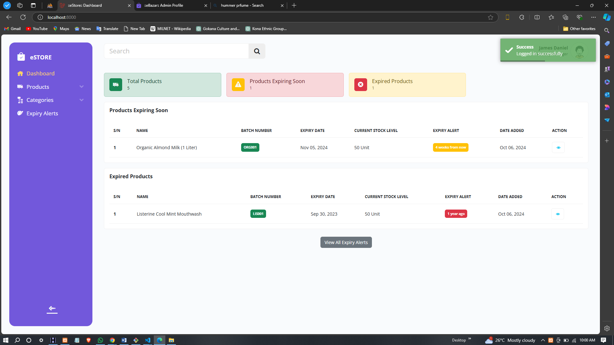
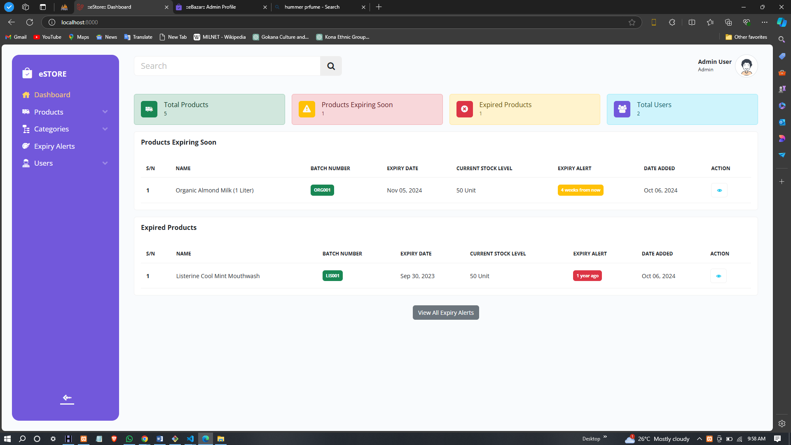
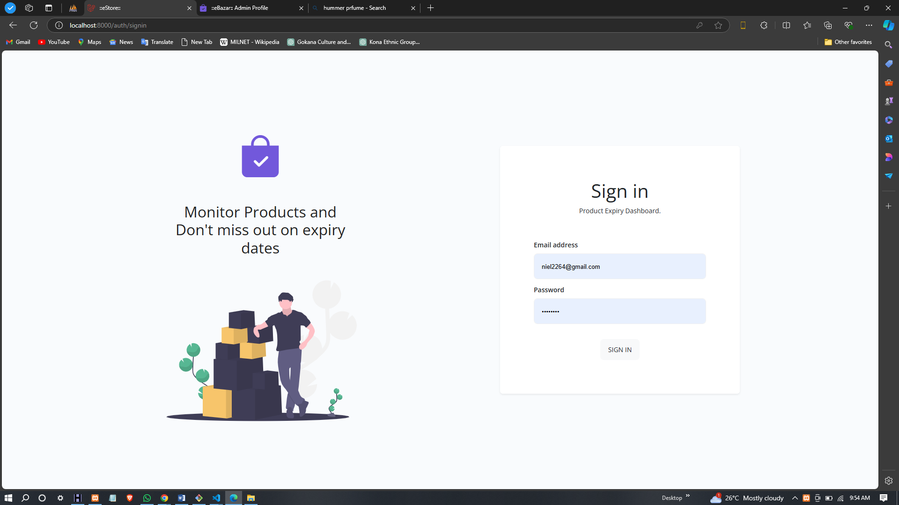
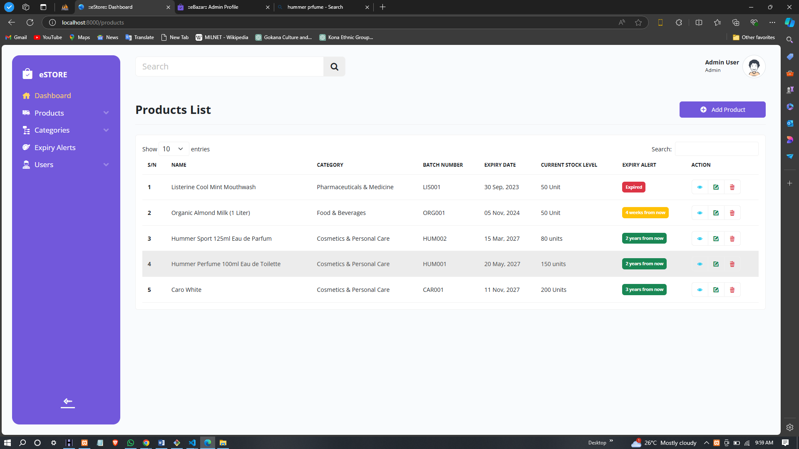
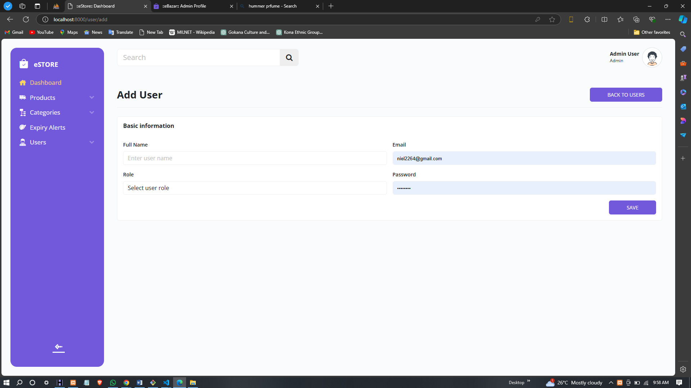
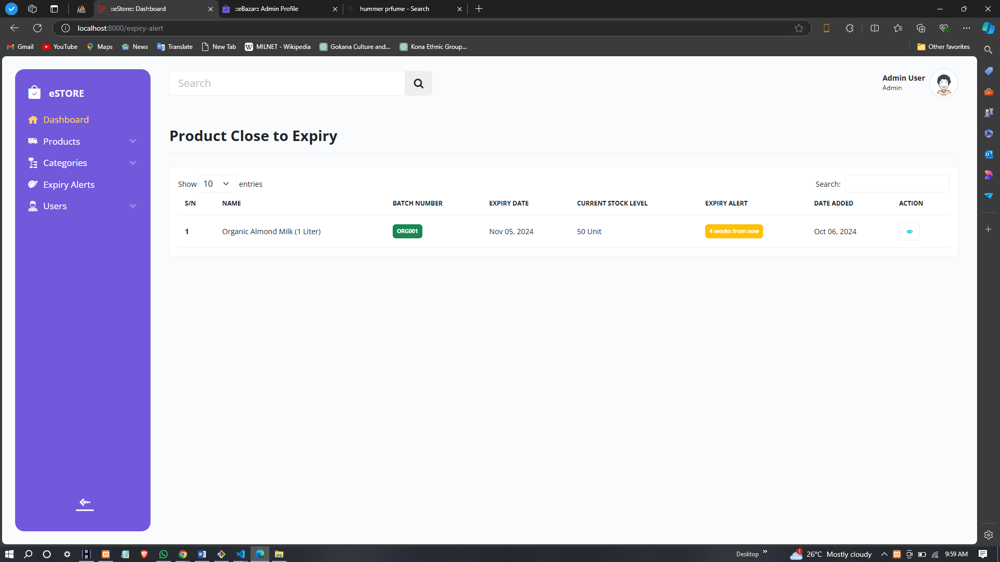
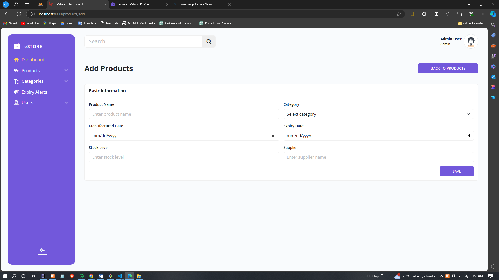

# DESIGN AND IMPLEMENTATION OF A PRODUCT EXPIRY ALERT MANAGEMENT SYSTEM

The **Product Expiry Alert Management System** helps store managers, staff, and administrators effectively track product expiration dates and manage inventory. The system provides real-time notifications, automated alerts, and reporting capabilities to ensure products are used before they expire, minimizing waste and improving inventory efficiency.

---

# =========================================
# HOW TO START THE PROJECT
# =========================================

### Clone the repository
``git clone https://github.com/Niel22/Product-Expiry-Alert-System.git``
``cd project-folder``

### Install PHP dependencies
``composer install``

### Create environment file
``cp .env.example .env``

### Generate application key
``php artisan key:generate``

### -----------------------------------------
### Update database credentials in .env
### -----------------------------------------
### DB_DATABASE=your_database_name
### DB_USERNAME=your_database_user
### DB_PASSWORD=your_database_password

### Run migrations and seed default data
``php artisan migrate --seed``

### Start the Laravel development server
``php artisan serve``

### Application will be available at:
### http://127.0.0.1:8000

### =========================================
### DEFAULT ADMIN LOGIN
### =========================================
### Email: admin@example.com
### Password: password
### Role: Admin

## Features

### 1. **User Authentication**
The system includes a secure login page where store managers, staff, and administrators can log in to their personalized dashboards. The authentication ensures that each user has appropriate access based on their role.

---

### 2. **User Dashboard**
The user dashboard provides an overview of key information like the number of products nearing expiration and upcoming alerts. It helps users stay on top of inventory management tasks and ensure timely actions.

---

### 3. **Admin Dashboard**
The admin dashboard offers a higher level of control, enabling administrators to manage users, view overall inventory health, and generate reports on expired products and upcoming expirations.

---

### 4. **Product Listing Page**
The product listing page allows users to view all the products in the system. Each product shows its name, quantity, and expiration date. It provides a quick overview and allows users to manage products efficiently.

---

### 5. **Add Product Page**
Users with appropriate access can add new products to the system. The page allows users to input essential product details, including name, quantity, and expiration date. The system will track the expiration date and generate alerts accordingly.

---

### 6. **Expiry Product Alert Page**
This page shows a list of products that are nearing their expiration date. Users can view detailed alerts and take necessary actions to prevent waste or loss of perishable goods.

---

### 7. **Add User Dashboard**
Admins can manage user accounts, adding or removing users, and assigning roles. This feature ensures that the system is scalable and that only authorized personnel have access to specific functions based on their roles.

---

## Technologies Used

This project utilizes the following technologies:

---

## Screenshots

Here are some screenshots of the **Product Expiry Alert Management System**:

### User Dashboard
_A snapshot of the user dashboard, which provides an overview of the upcoming product expirations and alerts._

---

### Admin Dashboard
_This is the admin dashboard, where administrators can manage users, view reports, and monitor overall inventory health._

---

### Login Page
_The secure login page where users enter their credentials to access the system._

---

### Product Listing Page
_A page where users can view a list of all products, along with their expiration dates and quantities._

---

### Add User Dashboard
_The page where administrators can manage user accounts, adding or editing users and assigning roles._

---

### Expiry Product Alert Page
_A dedicated page showing products that are nearing their expiration dates, providing actionable alerts for users._

---

### Add Product Page
_This page allows authorized users to add new products to the system, including their expiration date and quantity._

---

## Conclusion

The **Product Expiry Alert Management System** addresses the core challenges of inventory management by providing an intuitive and user-friendly interface for tracking product expirations and managing stock. With automated notifications, scalable architecture, and detailed reporting capabilities, the system improves efficiency and minimizes waste. Built with modern technologies like **HTML**, **CSS**, **Bootstrap**, **JavaScript**, **Laravel**, and **Livewire**, the system is both powerful and flexible for businesses dealing with perishable goods.

For any questions or feedback, feel free to reach out:

**Contact**: [niel2264@gmail.com](mailto:niel2264@gmail.com)
